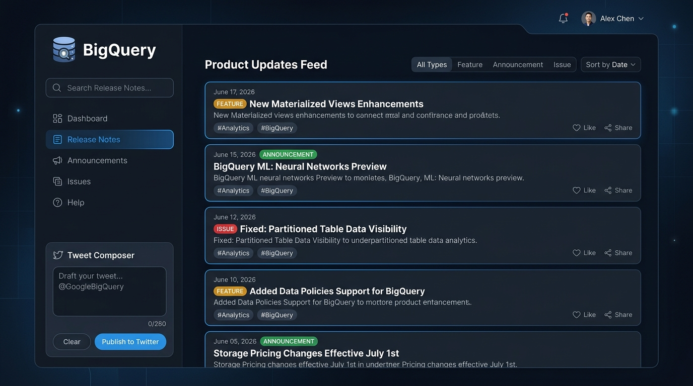

# BigQuery Release Notes Tracker & Share Hub

A modern, responsive dashboard to monitor official Google Cloud BigQuery release updates and draft/share them on Twitter/X with a single click.



## Features
- 🔄 **Real-time Synchronization**: Fetches and parses the official Google Cloud BigQuery RSS/Atom release feed.
- 🏷️ **Intelligent Categorization**: Detects and separates daily release logs into distinct modules based on updates (e.g., Features, Announcements, Issues, Deprecations).
- 🔍 **Search & Filter**: Find updates instantly with instant search keyword indexing and filtering categories.
- 🐦 **Custom X/Twitter Composer**: Select any release card to generate a clean, formatted tweet including appropriate badges, summaries, and official documentation links.
- 🎨 **Premium Aesthetics**: Elegant dark-themed dashboard featuring fluid glassmorphic styling, custom loading spinners, and micro-animations.

## Technology Stack
- **Backend**: Python Flask, Requests, BeautifulSoup (for HTML cleanup and segmentation)
- **Frontend**: Vanilla HTML5, CSS3, ES6 JavaScript, FontAwesome (for icons), and Google Fonts (Outfit & Plus Jakarta Sans)

## Getting Started

### Prerequisites
- Python 3.8 or higher
- Git (optional, for code management)

### Installation
1. Clone this repository:
   ```bash
   git clone https://github.com/harshitsharma200377-spec/HarshitSharma-bq-release-notes-app.git
   cd HarshitSharma-bq-release-notes-app
   ```

2. Create and activate a virtual environment:
   ```bash
   # On Windows
   python -m venv venv
   venv\Scripts\activate

   # On macOS/Linux
   python3 -m venv venv
   source venv/bin/activate
   ```

3. Install the required dependencies:
   ```bash
   pip install -r requirements.txt
   ```

### Running the App
Start the Flask development server:
```bash
python app.py
```
Open your browser and navigate to **`http://localhost:5000/`**.

## Project Structure
```text
├── app.py                  # Flask application & Feed parser
├── requirements.txt        # Python package dependencies
├── .gitignore              # Ignored files for version control
├── README.md               # Project documentation
├── templates/
│   └── index.html          # Main HTML structure
└── static/
    ├── css/
    │   └── style.css       # Layout styles & Custom Dark Theme
    └── js/
        └── main.js         # API controller, Filters & Twitter Intent
```

## License
Distributed under the MIT License. See `LICENSE` for more details.
